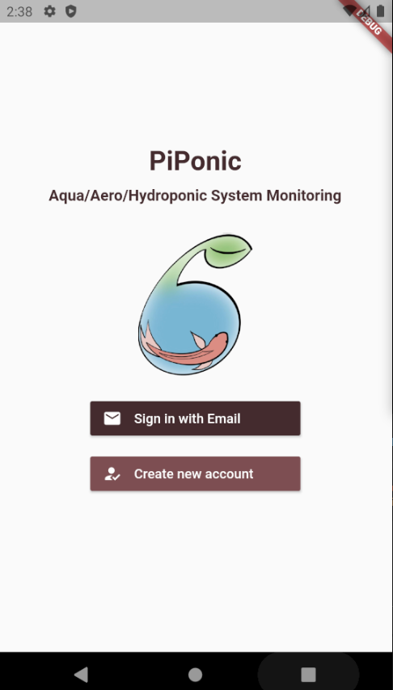

#  piponic_cloud 

## Project Description

This project aims to reduce urban food insecurity by reducing the cost and labour requirements of monitoring aquaponic or hydroponic food-growing systems. Designed specifically for hobbyist or small-scale growers, our project monitors critical system variables such as pH, temperature, and water-level and provides autonomous control. Critical notifications, real-time information, control settings, and system-history is available to users on a mobile application. 

 &nbsp;&nbsp;&nbsp;  &nbsp;&nbsp;&nbsp; 

Our work contributes a low-cost, open-source hardware design, and IoT development framework that will allow hobbyists to expand and modify the system for their own needs. By simplifying the communication protocols, growers can focus on adding new sensors instead of worrying about data-security. 

Our system can also operate on battery power in the event of a power-outage, a critical failure in aquaponic systems. This feature allows growers to be notified and to begin to take corrective action within the minute of the outage.

## This Repository

This repository provides Google Firebase functions to connect a mobile application to a sensing and control system on an aquaponic or hydroponic installation. 

This repository uses the following technologies:

- [Google Cloud IoT](https://cloud.google.com/iot/docs/quickstart): to Raspberry Pi devices to the cloud.
- [Google Firestore](https://cloud.google.com/iot/docs/quickstart): database to store sensor readings, configurations, and more.
- [Google Firebase Functions](https://firebase.google.com/docs/functions): hosting serverless functions in this repository.
- [Firebase Cloud Messaging](https://firebase.google.com/docs/cloud-messaging): service used to send notifications to the mobile application if there are any errors detected.

## Related Repositories

- [piponic](https://github.com/jaydenleong/piponic): A sensing and control system for aquaponics or hydroponics. Runs on a Raspberry Pi and connects to the mobile application using this repository.
- [piponic_app](https://github.com/jaydenleong/piponic_app): The mobile application for users to remotely monitor and control their aqua/hydroponic installation. Implemented using Google's Flutter.
- [piponic_docs](https://github.com/jaydenleong/piponic_docs): Detailed documentation for this project.

## Code Documentation

Here is a brief outline of the Firebase cloud functions found in `functions/index.js`: 

- `iotDeviceConfigUpdate`: When a device configuration is changed in the `Config` collection of Firestore, this function automatically updates the corresponding Google Cloud IoT device's configuration. This is used to send settings like the target pH, maximum temperature, and more to the Raspberry Pis.    
- `iotStoreDeviceUpdates`: This function listens to IoT device updates, then stores them in Firestore. It also check if there are any errors with sensor readings and sends notifications to the mobile application with Firebase Cloud Messaging. 
- `iotDeviceCommand`: Sends a command to a Raspberry Pi using Google Cloud IoT. For instance, pH calibration messages are sent this way.

## Emulation

Install dependencies using Node 12 (make sure you have this version):

```
cd functions
npm install
```

To run cloud functions locally, you can use the Firebase emulator. Please initialise this using the following commands:

```
firebase init emulators
firebase emulators:start
```

## Deploy

Please ensure that you have created or have access to a Firebase and Google Cloud project before starting this step. Instructions can be found in the [piponic](https://github.com/jaydenleong/piponic) and [piponic_app](https://github.com/jaydenleong/piponic_app) READMEs.

Run the following to deploy the Firebase cloud functions in `functions/index.js`:

```
sudo firebase deploy --only functions
```

Or, to deploy only a single function:

```
sudo firebase deploy --only "functions:<FUNCTION-NAME>"
```

Sometimes, eslint errors will prevent deployment. To fix linter errors automatically, try the following:

```
npm run lint -- --fix
```


